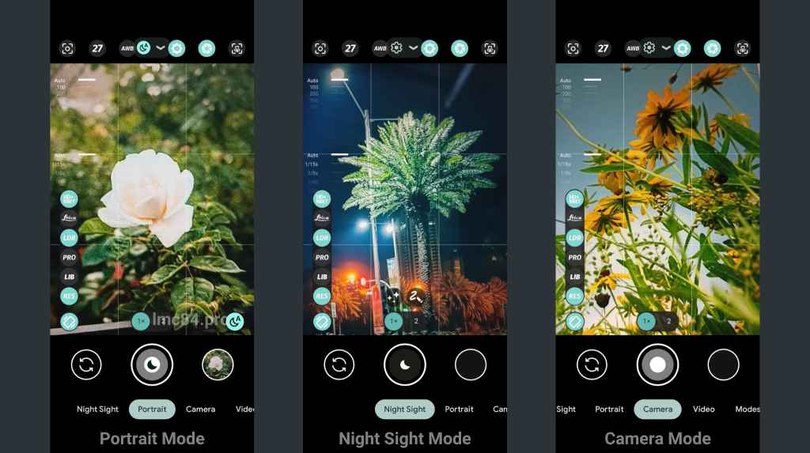

# 📸 ARCam - GCam Enhanced

ARCam is a **customized Google Camera (GCam) mod** based on **LMC by Hasil**.  
It includes **optimized XML configurations**, tuned for improved photography with better details, dynamic range, and low-light performance.  

---

## ✨ Features

- 🔧 Based on GCam Port **LMC by Hasil**
- ⚡ Custom XML tuning for sharper images
- 🌙 Enhanced Night Sight & HDR+
- 🎨 Improved color balance and contrast
- 📷 Support for multiple lenses (if device supports)
- ⚙️ Easy XML import/export

---

## 📥 Installation

1. Download the latest **ARCam APK** from the [Releases](../../releases) section.
2. Install it on your Android device. (Enable *Install from Unknown Sources* if required)
3. Copy the provided **XML config** into:
```

InternalStorage/ARCam/

```
*(Create folders if they don’t exist)*
4. Open ARCam → Double tap near the shutter button → Select the XML → Click **Restore**.

---

## 📂 Folder Structure
```

ARCam/
├── data/       # ARCam builds [Root]
├── xml/        # Custom XML configs
├── image/      # Sample images
└── README.md

```

---

## 📸 Screenshots:




---

## 🚀 Roadmap
- [x] Add more XML presets for different devices  
- [x] Night Sight fine-tuning  
- [x] Portrait mode improvements  
- [x] Add device-specific configs  
- [x] Split data app
- [ ] Create Magisk Modules
- [ ] Create ARCam Installer  

---

## 🙌 Credits
- **LMC by Hasil** – Original mod base  
- **Google Camera (GCam)** – Official camera app by Google  
- Community testers & contributors  

---

## 📜 License
This project is shared **for educational and personal use only**.  
All rights of the original GCam/LMC remain with their respective authors.

